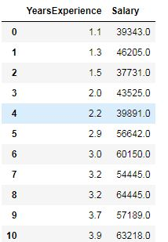
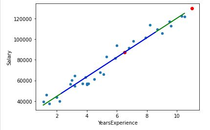

# ML_Simple_Linear_Regression_Salary_Calculator
Salary calculator based on years of experience

Tasks:

- csv file reading
- dataset visualization
- model construction
- model trainning
- accuracy calculation
- random values prediction
- model and values visualization

  
